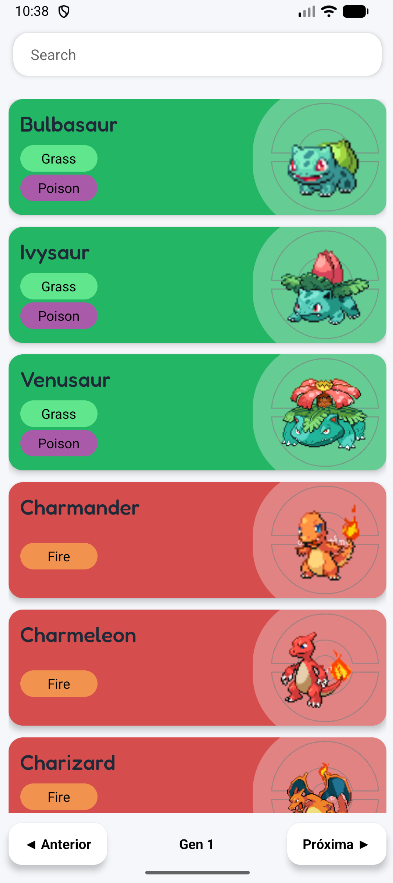
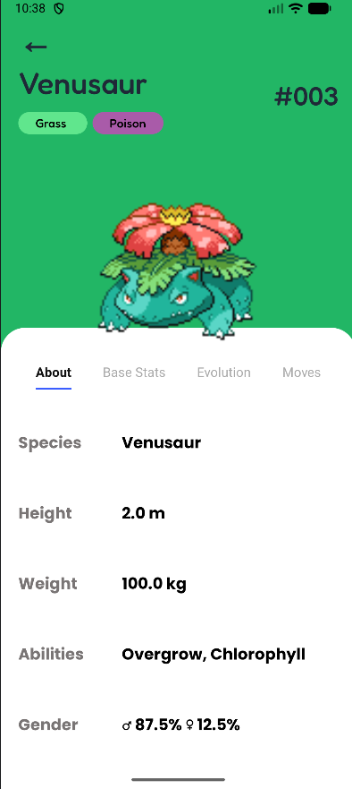
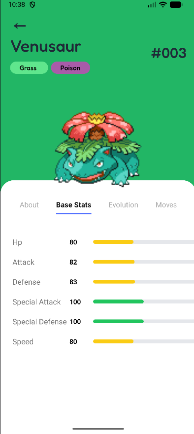
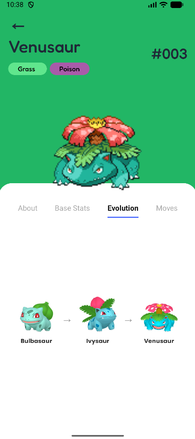

Integrantes do Grupo:
Kayk monteiro
Matheus Cogliatti
Maxwell dos Santos
Esterleane
Paola Fiel

# 📱 Pokédex React Native

Uma Pokédex desenvolvida com **React Native**, **Expo** e **TypeScript**, consumindo dados da **PokéAPI**. O aplicativo permite navegar pelos Pokémon da primeira geração, visualizar informações detalhadas, estatísticas, evoluções e golpes de cada criatura.

## 🚀 Tecnologias Utilizadas

* React Native
* Expo
* TypeScript
* Axios
* React Navigation
* PokéAPI

---

## ✨ Funcionalidades

* 🔍 Busca de Pokémon por nome
* 📋 Listagem dos Pokémon por Geração 
* 🎨 Interface dinâmica baseada no tipo do Pokémon
* 📊 Visualização de atributos e estatísticas
* 🌱 Exibição da cadeia evolutiva
* ⚔️ Consulta de golpes (moves)
* 📱 Interface responsiva para dispositivos móveis

---

## 📸 Screenshots

### Tela Inicial


### Informações Gerais


### Estatísticas


### Evoluções


### Golpes


---

## ⚙️ Instalação

Clone o repositório:

```bash
git clone https://github.com/monteirokaykdev/Pokedex-ReactNative.git
```

Entre na pasta do projeto:

```bash
cd Pokedex-ReactNative
```

Instale as dependências:

```bash
npm install
```

Execute o projeto:

```bash
npx expo start
```

---

## 🌐 API Utilizada

Este projeto consome dados da:

* https://pokeapi.co/

---

## 📌 Melhorias Futuras

* ⭐ Sistema de favoritos
* 🌙 Tema escuro
* ❤️ Tela de Pokémon favoritos
* 🔄 Busca por número da Pokédex
* 📈 Comparação entre Pokémon
* 🎵 Sons e animações

---

## 👨‍💻 Autor

**Kayk Sardou Monteiro**

* GitHub: https://github.com/monteirokaykdev
* LinkedIn: [www.linkedin.com/in/kayk-monteiro](http://www.linkedin.com/in/kayk-monteiro)
